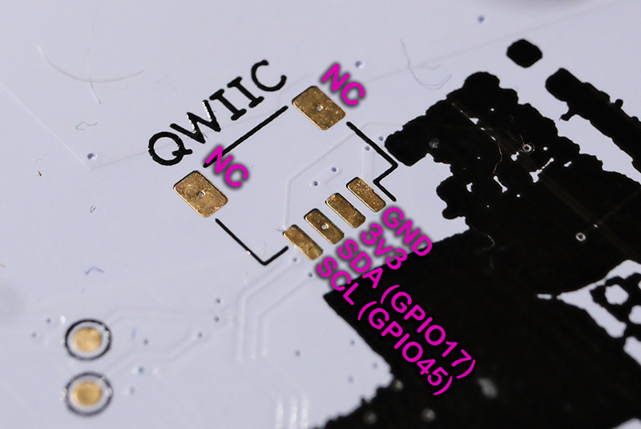
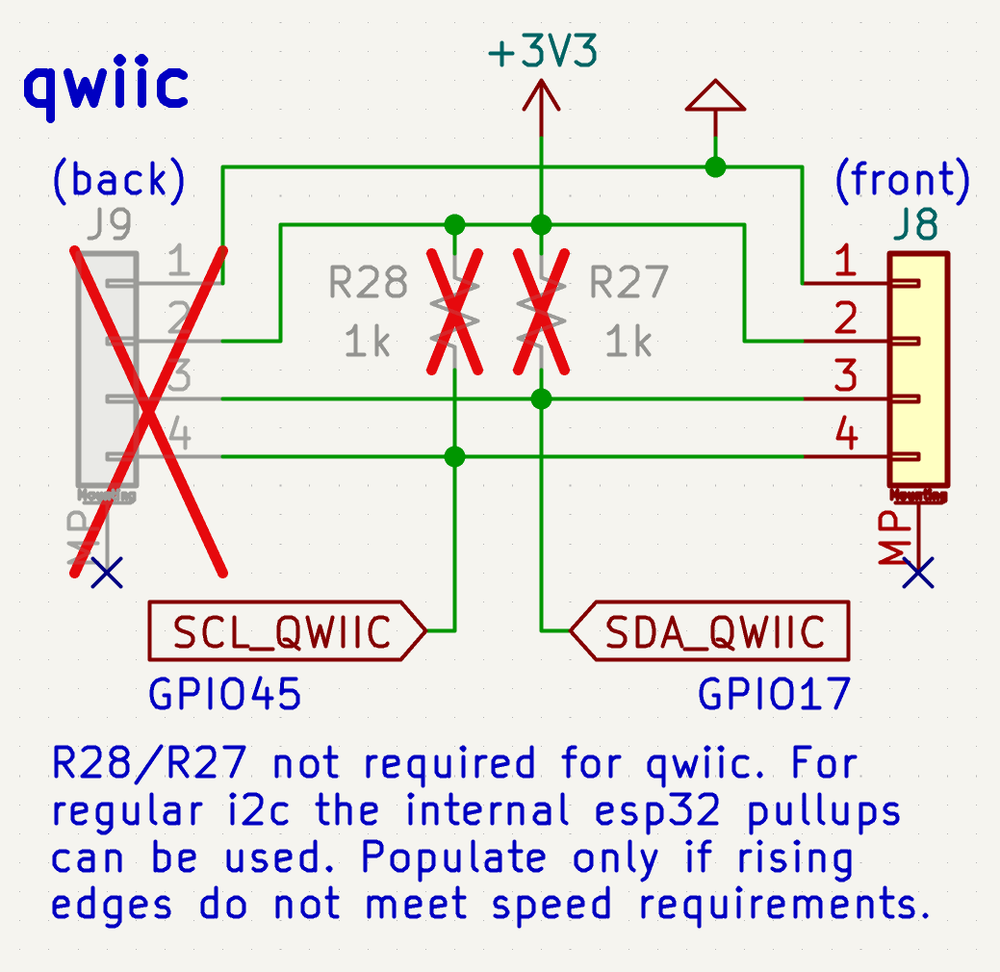
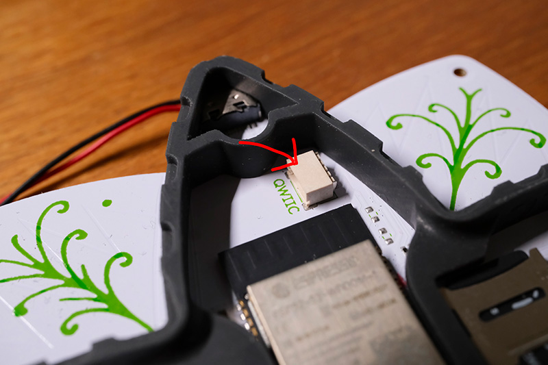
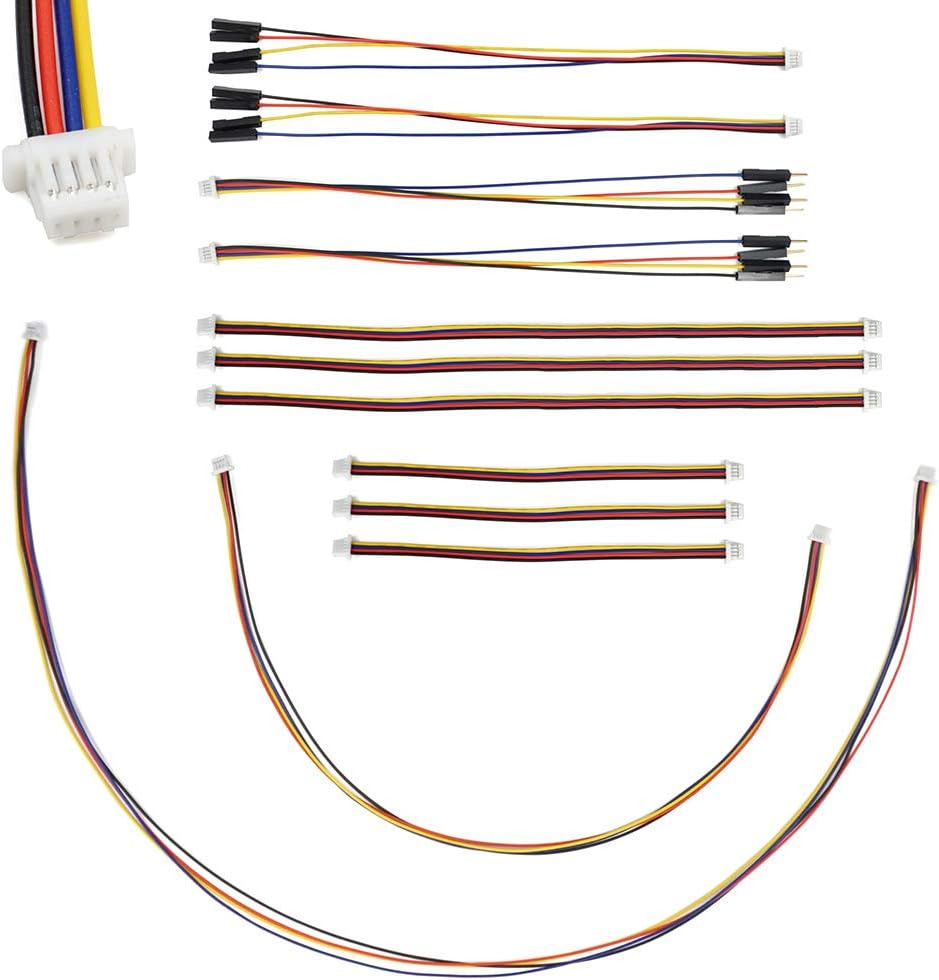

I2C / Qwiic Expansions
====================================

Introduction
--------------

The flow3r has two footprints for an JST-SH 4-pin connector for adding electronics.
This connector follows the pinout for the I2C Qwiic / Stemma QT standard.
Qwiic was developed by Sparkfun as a simple standard pinout for I2C devices.

**Both Qwiic and Stemma QT are compatible with each other** and follow the same pinout and connector standard. The difference is mostly about level shifting when using 5V I2C hosts.
Both Sparkfun and Adafruit offer a huge amount of little breakout boards that make it very easy to connect new hardware to the flow3r.
You will also find a lot of third parties offering hardware for this standard as it has established itself as a standard I2C breakout.

It is the best way to extend your flow3r with sensors and other hardware modifications.
**The pins available can also be used for GPIO or any other bus** you desire as the ESP32-S3 has a full switch matrix and any peripheral (except Analog) can be routed to any pin.

Pinout and locations
--------------------
The footprint on the inside is populated for you with a connector and is ready to be used.
The footprint on the backside is not populated and you can solder a connector there if you want to use it or solder some wires to it directly.
Keep in mind that both footprints connect to the exact same signals. It's just for convenience to offer access in multiple places.

The pinout is as follows:
::
    1. GND
    2. 3V3
    3. SDA (GPIO 17)
    4. SCL (GPIO 45)

See the ESP32-S3 datasheet for more information about what else you can do with these pins. GPIO17 is also Analog capable.

Here is a picture of the unpopulated backside footprint with the pinout overlayed:

And here the excerpt from the schematic, note that there are no fixed pull ups soldered by default so you can use it with other buses without issues.

And on the inside you can find the populated connector above the ESP32-S3.
You can modify the 3D printed spacer with a bit of sand paper by either making the battery cable slot larger or by adding a new slot where desired.
Or modify the source files and print your own spacer that accommodates your needs.

Software
--------

You can directly access the I2C bus from Micropython as ``I2C(1)``. You need firmware 1.3 or newer for this (older firmware had the wrong pins assigned).

For a simple example see the I2C scanner app that comes with flow3r firmware 1.3.
For how to use I2C in Micropython see the Micropython docs: https://docs.micropython.org/en/latest/library/machine.I2C.html

I2C Scanner app: https://git.flow3r.garden/flow3r/flow3r-firmware/-/blob/main/python_payload/apps/i2c_scanner/__init__.py

There is also an example of how to adapt an existing CircuitPython library to work with the flow3r with the CO2 monitor app available on the app store.
The source code for that can be found here: https://git.flow3r.garden/timonsku/co2-monitor-scd4x

Where to get hardware
---------------------

You can get cables, connectors and hardware breakout from Sparkfun, Adafruit and many other vendors.

https://www.sparkfun.com/qwiic

https://www.adafruit.com/category/620

You can also easily buy cables and connectors from your favorite online retailer (Ebay, Amazon, Aliexpress etc) for cheap.

https://www.ebay.de/sch/i.html?_nkw=jst-sh+4pin+1.0mm

https://www.aliexpress.com/w/wholesale-jst-sh-4-pin-1.0mm.html

https://www.amazon.de/s?k=%22jst-sh%22+4+pin+1.0mm

**A good search term is "JST-SH 4-pin 1.0mm".** Many online shops will have cheap kits that have both cables and connectors for 5-8€ for a pack of 20-50.
You also get cables that adapt to breadboard friendly jumper connectors if you want to hack something together on a breadboard.

The original part number for the SMT PCB connector is **SM04B-SRSS-TB(LF)(SN)** (LCSC C160404) but you also get cheaper clones on LCSC.
There are also vertical versions but they are not fully compatible with the footprint on the flow3r as the mechanical pads are not in the same place.

